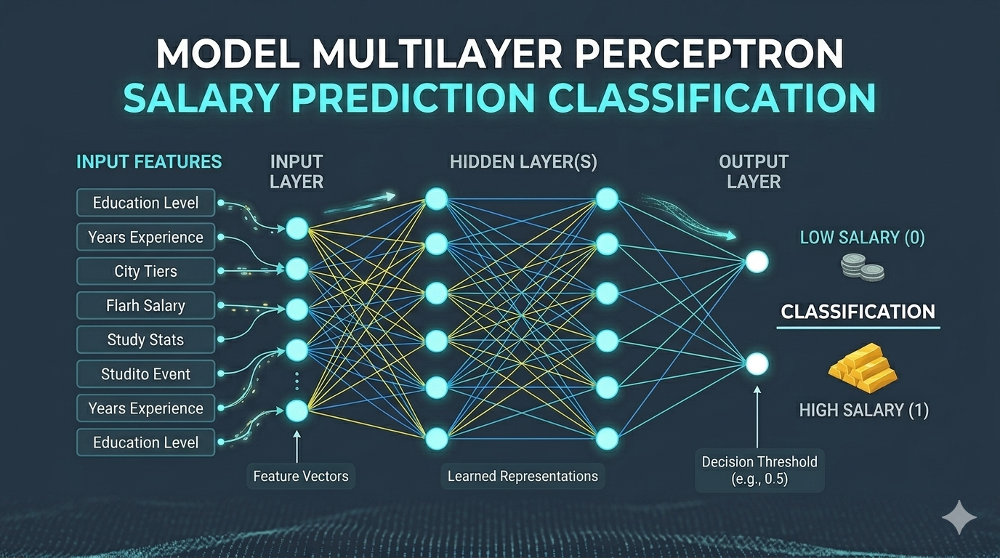

# Model Multilayer Perceptron Salary Prediction Classification 

This repository presents a complete **Machine Learning + MLOps** solution for income classification using the **Salary Prediction Classification of Adult Census Income Dataset**.

The main objective of this project is to predict whether an individual's annual income exceeds **$50K/year** using a **Multilayer Perceptron (MLP)** neural network architecture.

Beyond model training, this project also emphasizes:

- Data Engineering
- Statistical Data Cleaning
- Feature Selection
- Experiment Tracking
- Model Versioning
- Cloud Monitoring with Weights & Biases

---

<div align="center">


<br>
<h1>Track loss curves, accuracy, feature importance, and experiment metrics in real-time. </h1>

[](https://wandb.ai/moiseslopesdasilva708811-ufrn/salary_prediction_mlops/reports/MLP-Training-Results--VmlldzoxNjc0ODgzMw)
[](https://api.wandb.ai/links/moiseslopesdasilva708811-ufrn/ztrmqhnp)

</div>




---

### Configuration requirements.txt
To download the libraries necessary to run the project, it is necessary to run the following instruction inside the notebook in the folder /notebooks/Multilayer_Perceptron_Salary_Prediction_Classification.ipynp

text
```
%%writefile requirements.txt
numpy
pandas
scikit-learn
torch
matplotlib
seaborn
wandb
scipy
kagglehub
jupyter
statsmodels
pytest
scipy

```
From this point, follow the next instructions in this README to run this Multilayer Perceptron Model

# Project Objective

This project was developed to apply modern concepts of:

- Data Science
- Machine Learning
- Deep Learning
- MLOps Engineering

The goal is to build a reproducible, scalable and production-oriented Machine Learning pipeline.

---

# Technologies Used

| Technology | Purpose |
|---|---|
| Python | Main programming language |
| Pandas | Data manipulation |
| NumPy | Numerical operations |
| Scikit-Learn | Preprocessing and evaluation |
| PyTorch | Neural network implementation |
| Weights & Biases | Experiment tracking |
| Matplotlib | Data visualization |
| Jupyter Notebook | Prototyping and development |

---

# Pipeline Architecture

```text
Data Collection
        ↓
Data Cleaning & Preprocessing
        ↓
Statistical Analysis
        ↓
Feature Selection
        ↓
Normalization
        ↓
Neural Network Training
        ↓
W&B Monitoring
        ↓
Model Versioning
```

---

## Estrutura do Projeto

```bash
MLOps-Salary-Prediction-Dataset/
│── .gitignore
│── README.md
│── requirements.txt
│
├── models/
│   └── mlp_salary_model.pkl
│
├── notebooks/
│   │── best_model.pth
│   │── mlp_salary_model.pkl
│   │── Multilayer_Perceptron_Salary_Prediction_Classification.ipynb
│   │── requirements.txt
│   │
│   └── images/
│       ├── confusion_matrix.png
│       ├── feature_importance_comparison.png
│       ├── histograms.png
│       ├── loss_curve.png
│       ├── Project_Multilayer_Perceptron.png
│       └── total_green_heatmap.png
│
├── src/
│   │── __init__.py
│   │
│   ├── data/
│   │   ├── cleaning_data.py
│   │   ├── data_downloading.py
│   │   ├── preprocessing.py
│   │   └── __init__.py
│   │
│   ├── features/
│   │   ├── feature_selection.py
│   │   └── __init__.py
│   │
│   ├── models/
│   │   ├── evaluate.py
│   │   ├── model.py
│   │   ├── train.py
│   │   └── __init__.py
│   │
│   └── utils/
│       ├── config.py
│       ├── helpers.py
│       ├── logger.py
│       └── __init__.py
│
├── tests/
│   ├── test_data.py
│   ├── test_model.py
│   └── test_pipeline.py
│
└── wandb/
```
---

### Model Multilayer Perceptron Performance

| Metric | Value |
| :--- | :---: |
| **Accuracy** | 85.2% |
| **Precision** | 0.78 |
| **Recall** | 0.65 |
| **F1-Score** | 0.71 |
| **AUC-ROC** | 0.89 |
# Pipeline Stages

## ✔ Data Collection

The project uses the **Adult Census Income Dataset**, containing information such as:

- Age
- Education
- Marital Status
- Occupation
- Work Hours
- Relationship
- Native Country
- Capital Gain/Loss

---

# ✔ Data Cleaning & Preprocessing

Several preprocessing techniques were applied:

## ✔ Duplicate Removal

Avoids statistical bias caused by repeated samples.

## ✔ Missing Values Treatment

Using:

- Median imputation for numerical variables
- Robust strategies for categorical data

## ✔ Outlier Treatment

Using the **IQR (Interquartile Range)** method.

---

# Feature Selection

The project applies multiple feature selection strategies:

- Variance Inflation Factor (VIF)
- Spearman Correlation
- Mutual Information

Main goals:

- Reduce computational cost
- Minimize noise
- Reduce multicollinearity
- Improve model generalization

---

# 🧠 Neural Network Architecture

The neural network was implemented using **PyTorch**.

## MLP Structure

```text
Input Layer
     ↓
Linear (64)
     ↓
ReLU
     ↓
Linear (32)
     ↓
ReLU
     ↓
Linear (1)
     ↓
Sigmoid
```

## Features

- Funnel-shaped architecture
- Early Stopping
- Implicit regularization
- Reproducible pipeline
- Real-time metric monitoring

---

# Training

During training, the following metrics are tracked:

- Loss
- Accuracy
- Precision
- Recall
- F1-Score
- Confusion Matrix
- Hyperparameters
- Execution Time

All metrics are automatically integrated into **Weights & Biases**.

---

# Evaluation Metrics

- Accuracy
- Precision
- Recall
- F1-Score
- Confusion Matrix

---

# Weights & Biases Integration

The project uses **W&B** for:

- Experiment tracking
- Run comparison
- Real-time monitoring
- Metrics storage
- Model versioning
- Hyperparameter logging

---

# Setup & Execution Guide

## 1️⃣ Clone the Repository

```bash
git clone https://github.com/moiseslopesdasilva708811-ai/MLOps-Salary-Prediction-Dataset.git

cd MLOps-Salary-Prediction-Dataset
```

---

# 2️⃣ Create a Virtual Environment

## Windows

```bash
py -m venv .venv

.venv\Scripts\activate
```

## Linux/Mac

```bash
python3 -m venv .venv

source .venv/bin/activate
```

---

# 📦 3️⃣ Install Dependencies

```bash
python.exe -m pip install --upgrade pip

pip install -r requirements.txt
```

---

# 🔐 4️⃣ Authenticate with W&B

```bash
wandb login
```

Paste your API Key when prompted.

---

# ▶️ 5️⃣ Run the Project

Open the notebook:

```text
notebooks/
```

and execute:

```text
Multilayer_Perceptron_Salary_Prediction_Classification.ipynb
```

The pipeline will automatically:

1. Load/download the dataset
2. Perform statistical cleaning
3. Encode categorical variables
4. Apply Feature Selection
5. Normalize the data
6. Train the MLP model
7. Evaluate the model
8. Send metrics to W&B
9. Save the trained model

---

# 📊 Results

At the end of training, the project generates:

- Loss Curves
- Accuracy Curves
- Confusion Matrix
- Classification Report
- Run Comparisons
- Feature Importance Analysis

All results are available directly in the W&B dashboard.

---

# Future Improvements

- CI/CD Pipelines
- MLflow Integration
- Data Version Control
- Hyperparameter Tuning
- REST API for inference

---

# 🎓 Author

## Moisés Lopes

Focused on:

- Machine Learning
- Deep Learning
- MLOps
- Artificial Intelligence
